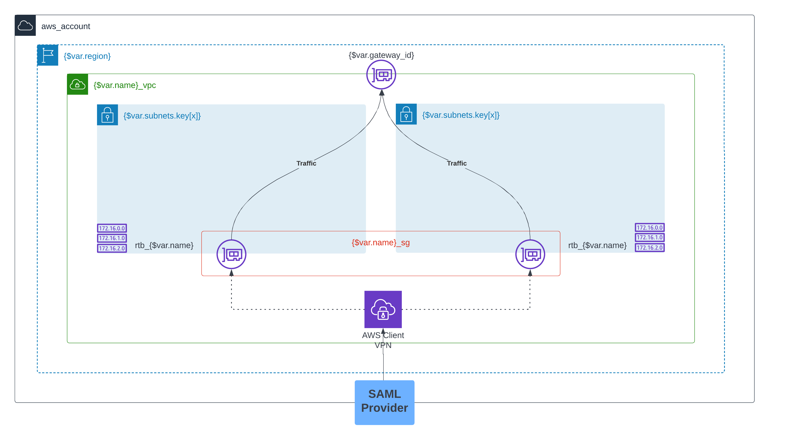

# Summary
This module is intended to provide a template for all Client VPN deployments that leverage SAML for authentication and sends all traffic to a single gateway (such as a Transit Gateway).  This module is nearly a complete solution as it deploys the entire environment to be used for client VPN traffic. A few prerequisites are needed for this module and you may need to create your own wrapper around it for more complex configurations.

# General Information

- The **subnets** variable is where you indicate the number of subnets (and AZs) to deploy to. It is recommended defining, at least, 2 subnets in different availablity zones. The diagram below illustrates this.
- **Split-tunneling** is used. That is, only traffic with routes specified in the Client VPN is going through the VPN connection. All other traffic bypasses the VPN. This can be turned off via setting a variable explained below to *false*
- **SNAT (Static NAT)** is being used. That is, all traffic from the Client VPN network is being translated, 1:1, to an IP address in the local VPC network(s).
    * **Important:** this means downstream ACLs, routes and security rules need to consider the local VPC CIDR range and **NOT** the ClientVPN CIDR range.
- This deployment leverages **SAML** as a means of user authentication. If you require another form of authentication, this module will not work.*

# Architecture

# Prerequisites
1. An AWS account.
2. Access to AWS CLI and the correct permissions to deploy all relevant resources.
3. A SAML integration has been created for this deployment and you have received the related metadata.xml file.
4. Generate the following TLS certificate files and place them in a local directory that can be accessed by the module you are deploying.
    * CA (*e.g. ca.crt*)
    * Server certificate (*e.g. server_cert.crt*)
    * Server private key: (*e.g. server_private_key.key*)
    * Check out: [this tool](https://github.com/OpenVPN/easy-rsa)

# Use
**Important:** after deployment of this module, you will need to download the client configuration file from the AWS management console and provide this to the intended end-users of the VPN.

Call the module as seen below. Refer to the README or the below sections for more information on the necessary inputs (variables to pass). The below is a reference, please use the most recent version of the module and declare your own variables.
~~~~
module "aws_client_vpn" {
  source = "./module/"
  
  name                             = "test_vpn"
  region                           = "us-east-1"
  cert_chain_path                  = "./path/to/file/"
  server_cert_body_path            = "./path/to/file/"
  server_private_key_path          = "./path/to/file/"
  saml_metadata_path               = "./path/to/file/"
  vpc_cidr                         = "10.0.0.0/16"
  client_cidr                      = "192.168.0.0/22"
  dns_servers                      = ["169.254.169.253", "10.0.0.2"]
  client_login_banner_text         = "You are now accessing the Client VPN."
  client_login_banner_enabled      = true
  use_default_client_vpn_auth_rule = true
  use_tgw                          = true
  gateway_id                       = var.gateway_id
  subnets = {
    "test_vpn_user_1" = { cidr_block = "10.0.0.0/24", az = "us-east-1a" }
    "test_vpn_user_2" = { cidr_block = "10.0.1.0/24", az = "us-east-1b" }
  }
  routes_cidr = [
    "x.x.x.x/16",  # destination 1
    "x.x.x.x/24",  # destination 2
  ]
  sg_rules = {
    "outbound_https" = {
      type             = "egress",
      from_port        = 443,
      to_port          = 443,
      protocol         = "tcp",
      cidr_blocks      = ["<dest_cidr>"]
      ipv6_cidr_blocks = []
    }
    "inbound_ephemeral" = {
      type             = "ingress",
      from_port        = 1024,
      to_port          = 65535,
      protocol         = "tcp",
      cidr_blocks      = ["<dest_cidr>"]
      ipv6_cidr_blocks = []
    }
    ...
  }
  tag_application   = "test_vpn"
  tag_environment   = "test"
  tag_owner         = "test"
  tag_service       = "test_vpn"
  tag_map_server_id = var.map_server_id
 }
}
~~~~ 

# Limitations
* The Client VPN route table can have a **MAX** of 20 routes. For every route you define, you need to multiply that by the number of subnets. Additionally, each subnet introduces a propagated route to the routing table. For example, if you have **5 routes** and **2 subnets**, you will have **12 routes** in the routing table ((5*2)+2).
* For simplicity of deployment and the module, only **one** security group is defined here and attached to the Client VPN. If you require more security groups, it will require an update/fork of this module.
* This module was only tested using gateway IDs for **transit gateways, virtual gateways, NAT gateways,** and **internet gateways**. All other gateway types have not been tested and may not be compatible with this module.
* Due to the complex and dynamic nature of [authorization rules](https://docs.aws.amazon.com/vpn/latest/clientvpn-admin/cvpn-working-rules.html), this module includes a default authorization rule to allow all who connect to the VPN to access all destination (CIDRs) relevant to the VPN.
    - If you require specific authorization rules defined, set the **use_default_client_vpn_auth_rule** variable to **false** and define the resources outside of the module.
* All routes passed into the module will point to a single gateway (*gateway_id*). If you need routes to additional gateways, define them outside of the module using aws_route and all other necessary resources.

# Key inputs (please read carefully)
## Deployment
* **name →** A meaningful name for the specific deployment of the AWS Client VPN. This name is used to dynamically populate all name fields and tags.
* **region →** The AWS region where this VPN solution will be deployed.
* **vpc_cidr →** The CIDR range to be used for the VPC you are deploying this solution in.
* **client_cidr →** The CIDR range used for the Client VPN. This is the range users will be assigned an IP address from. **Minimum CIDR is a /22.**
* **gateway_id →** The AWS ID of the gateway you will direct all routes to. Gateway options include: TGW, IGW, VGW, and NAT Gateway. If you require routes to more than one gateway, you will need to create new *aws_route* resources outside of the module and attach them to the route table created in the module. If you require a target gateway that is not of the type above, this module will not work for you.
* **use_tgw →** If the **gateway_id** specified above of of type *transit gateway* then you **MUST** set this variable to **true**. If the **gateway_id** is of type *virtual gateway, NAT gateway,* or *internet gateway*, then set this variable to **false**.
* **dns_servers →** This should always be explicitly declared here. This will be a list of **only 2** strings. It is recommended that you use the AWS default DNS servers at **169.254.169.253** and your **base VPC CIDR plus 2** (*e.g. if vpc_cidr = 10.0.0.0/16 then dns_servers = ["169.254.169.253", "10.0.0.2"]*).
* **subnets →** A **map** that defines the name (key), CIDR, and AZ of each subnet you want deployed. Example:
~~~~
subnets = {
    "name_1" = { cidr_block = "10.0.0.0/24", az = "us-east-1a" }
    "name_2" = { cidr_block = "10.0.1.0/24", az = "us-east-1b" }
  }
~~~~
* **routes_cidr →** A **list** of all the routes (destinations) this VPN should reach. This list will dynamically create routes in the Client VPN route table and the subnet route table. Only the routes that point to the **gateway_id** defined above should be places here. If you need routes to other gateways, please create new *aws_route* resources outside of the module and attach them to the route table created in the module.
* **sg_rules →** A map of all the rules associated with the security group attached to the Client VPN. This is the security group that will apply to users of the VPN. See below for an example. The default is an **allow all** egress rule. **Important:** from_port and to_port **are not** the same as destination and source port. This is used for specifiying a **range** of ports to be specified in the ingress or egress rule.
~~~~
sg_rules = {
    "outbound_https" = {
      type             = "egress",
      from_port        = 443,
      to_port          = 443,
      protocol         = "tcp",
      cidr_blocks      = ["<dest_cidr>"]
      ipv6_cidr_blocks = []
    }
    "ingress_ephemeral" = {
      type             = "ingress",
      from_port        = 1024,
      to_port          = 65535,
      protocol         = "tcp",
      cidr_blocks      = ["<dest_cidr>"]
      ipv6_cidr_blocks = []
    }
    ...
  }
~~~~
* **use_default_client_vpn_auth_rule →** If you wish to define your own ***authorization rules** attached the AWS Client VPN, set this value to **false**. The default rules allow all people who authenticate to the VPN to reach all destinations associated with the VPN. This is an advanced feature and for more information see [this document.](https://docs.aws.amazon.com/vpn/latest/clientvpn-admin/cvpn-working-rules.html)
* **saml_metadata_path →** The local path to the .xml file associated with the Okta application created for this deployment.
* **cert_chain_path →** The local path for the certificate chain created for this deployment.
* **server_cert_body_path →** The local path for the server certificate body created for this deployment.
* **server_private_key_path →** The local path for the server private key created for this deployment.

## Tags
*The below are optional but it is important that you keep the convention used by your team.*

* **tag_application**
* **tag_environment**
* **tag_owner**
* **tag_service**
* **tag_version**
* **tag_map_server_id**

# Optional inputs
* **enable_connection_logs →** If you do not want logs enabled for your Client VPN connections, set this variable to **false**. Default is **true**.
* **log_retention_days →** If **enable_connection_logs** is set to **true** and you wish to specify a log expiration time, set the value here in **days**. Default is **0** (does not expire).
* **session_timeout_hours →** If you wish to adjust the session timeout for all VPN connections. The default is **8 hours**. This is the lowest value possible.
* **use_split_tunnel →** If you would like **all** traffic from the end-user to pass through the VPN, set the value to **false**. Otherwise, only traffic relevant to the VPN will pass through the VPN. It is recommend to use split tunneling whenever possible.
* **transport_protocol →** The transport protocol used for connections to the Client VPN. The default and recommended is **TCP**.
* **vpn_port →** The port you wish to use for connections to the Client VPN. The default is **443**.
* **client_connect_options_enabled →** Advanced feature. See point 8 [in this document.](https://docs.aws.amazon.com/vpn/latest/clientvpn-admin/cvpn-working-endpoints.html) Default is set to **false**.
* **client_connect_lambda_arn →** Only required if you set **client_connect_options_enabled** to **true**.
* **client_login_banner_enabled →** If you wish to specify a login message for connections to the Client VPN. The default is **false**.
* **client_login_banner_text →** Only required if you set **client_login_banner_enabled** to **true**

<!-- BEGIN_TF_DOCS -->
## Requirements

| Name | Version |
|------|---------|
|  [terraform](#requirement\_terraform) | ~> 1.3.0 |
|  [aws](#requirement\_aws) | ~> 4.0 |

## Providers

| Name | Version |
|------|---------|
|  [aws](#provider\_aws) | ~> 4.0 |

## Modules

| Name | Source | Version |
|------|--------|---------|
|  [tags](#module\_tags) | git::ssh://git@bitbucket.org/enlightedinc/terraform-common-tags.git | v1.1.0 |

## Resources

| Name | Type |
|------|------|
| [aws_acm_certificate.server](https://registry.terraform.io/providers/hashicorp/aws/latest/docs/resources/acm_certificate) | resource |
| [aws_cloudwatch_log_group.this](https://registry.terraform.io/providers/hashicorp/aws/latest/docs/resources/cloudwatch_log_group) | resource |
| [aws_cloudwatch_log_stream.this](https://registry.terraform.io/providers/hashicorp/aws/latest/docs/resources/cloudwatch_log_stream) | resource |
| [aws_ec2_client_vpn_authorization_rule.this](https://registry.terraform.io/providers/hashicorp/aws/latest/docs/resources/ec2_client_vpn_authorization_rule) | resource |
| [aws_ec2_client_vpn_endpoint.this](https://registry.terraform.io/providers/hashicorp/aws/latest/docs/resources/ec2_client_vpn_endpoint) | resource |
| [aws_ec2_client_vpn_network_association.this](https://registry.terraform.io/providers/hashicorp/aws/latest/docs/resources/ec2_client_vpn_network_association) | resource |
| [aws_ec2_client_vpn_route.this](https://registry.terraform.io/providers/hashicorp/aws/latest/docs/resources/ec2_client_vpn_route) | resource |
| [aws_iam_saml_provider.this](https://registry.terraform.io/providers/hashicorp/aws/latest/docs/resources/iam_saml_provider) | resource |
| [aws_route.this_gw](https://registry.terraform.io/providers/hashicorp/aws/latest/docs/resources/route) | resource |
| [aws_route.this_tgw](https://registry.terraform.io/providers/hashicorp/aws/latest/docs/resources/route) | resource |
| [aws_route_table.this](https://registry.terraform.io/providers/hashicorp/aws/latest/docs/resources/route_table) | resource |
| [aws_route_table_association.this](https://registry.terraform.io/providers/hashicorp/aws/latest/docs/resources/route_table_association) | resource |
| [aws_security_group.this](https://registry.terraform.io/providers/hashicorp/aws/latest/docs/resources/security_group) | resource |
| [aws_security_group_rule.this](https://registry.terraform.io/providers/hashicorp/aws/latest/docs/resources/security_group_rule) | resource |
| [aws_subnet.this](https://registry.terraform.io/providers/hashicorp/aws/latest/docs/resources/subnet) | resource |
| [aws_vpc.this](https://registry.terraform.io/providers/hashicorp/aws/latest/docs/resources/vpc) | resource |

## Inputs

| Name | Description | Type | Default | Required |
|------|-------------|------|---------|:--------:|
|  [cert\_chain\_path](#input\_cert\_chain\_path) | n/a | `any` | n/a | yes |
|  [client\_cidr](#input\_client\_cidr) | n/a | `any` | n/a | yes |
|  [client\_connect\_lambda\_arn](#input\_client\_connect\_lambda\_arn) | n/a | `string` | `""` | no |
|  [client\_connect\_options\_enabled](#input\_client\_connect\_options\_enabled) | n/a | `bool` | `false` | no |
|  [client\_login\_banner\_enabled](#input\_client\_login\_banner\_enabled) | n/a | `bool` | `false` | no |
|  [client\_login\_banner\_text](#input\_client\_login\_banner\_text) | n/a | `string` | `""` | no |
|  [dns\_servers](#input\_dns\_servers) | n/a | `list(any)` | <pre>[   "169.254.169.253",   "8.8.8.8" ]</pre> | no |
|  [enable\_connection\_logs](#input\_enable\_connection\_logs) | n/a | `bool` | `true` | no |
|  [gateway\_id](#input\_gateway\_id) | n/a | `any` | n/a | yes |
|  [log\_retention\_days](#input\_log\_retention\_days) | n/a | `number` | `0` | no |
|  [name](#input\_name) | The name of the application or service being deployed. | `string` | `"client_vpn"` | no |
|  [region](#input\_region) | The region of the AWS account where the internal VPN will be deployed. | `string` | `"us-east-1"` | no |
|  [routes\_cidr](#input\_routes\_cidr) | n/a | `set(string)` | n/a | yes |
|  [saml\_metadata\_path](#input\_saml\_metadata\_path) | n/a | `any` | n/a | yes |
|  [server\_cert\_body\_path](#input\_server\_cert\_body\_path) | n/a | `any` | n/a | yes |
|  [server\_private\_key\_path](#input\_server\_private\_key\_path) | n/a | `any` | n/a | yes |
|  [session\_timeout\_hours](#input\_session\_timeout\_hours) | n/a | `number` | `8` | no |
|  [sg\_rules](#input\_sg\_rules) | The region of the AWS account where the internal VPN will be deployed. | `map(any)` | <pre>{   "allow_all": {     "cidr_blocks": [       "0.0.0.0/0"     ],     "from_port": 0,     "ipv6_cidr_block": [       "::/0"     ],     "protocol": "-1",     "to_port": 0,     "type": "egress"   } }</pre> | no |
|  [subnets](#input\_subnets) | n/a | `any` | n/a | yes |
|  [tag\_application](#input\_tag\_application) | n/a | `string` | `""` | no |
|  [tag\_environment](#input\_tag\_environment) | n/a | `string` | `""` | no |
|  [tag\_map\_server\_id](#input\_tag\_map\_server\_id) | n/a | `string` | `""` | no |
|  [tag\_owner](#input\_tag\_owner) | n/a | `string` | `""` | no |
|  [tag\_service](#input\_tag\_service) | n/a | `string` | `""` | no |
|  [tag\_version](#input\_tag\_version) | n/a | `string` | `""` | no |
|  [transport\_protocol](#input\_transport\_protocol) | n/a | `string` | `"udp"` | no |
|  [use\_default\_client\_vpn\_auth\_rule](#input\_use\_default\_client\_vpn\_auth\_rule) | n/a | `bool` | `true` | no |
|  [use\_split\_tunnel](#input\_use\_split\_tunnel) | n/a | `bool` | `true` | no |
|  [use\_tgw](#input\_use\_tgw) | n/a | `bool` | n/a | yes |
|  [vpc\_cidr](#input\_vpc\_cidr) | n/a | `any` | n/a | yes |
|  [vpn\_port](#input\_vpn\_port) | n/a | `number` | `443` | no |

## Outputs

| Name | Description |
|------|-------------|
|  [client\_vpn\_arn](#output\_client\_vpn\_arn) | n/a |
|  [client\_vpn\_cidr](#output\_client\_vpn\_cidr) | n/a |
|  [client\_vpn\_dns\_name](#output\_client\_vpn\_dns\_name) | n/a |
|  [client\_vpn\_id](#output\_client\_vpn\_id) | n/a |
|  [security\_group\_arn](#output\_security\_group\_arn) | n/a |
|  [security\_group\_id](#output\_security\_group\_id) | n/a |
|  [subnet\_arns](#output\_subnet\_arns) | n/a |
|  [subnet\_cidrs](#output\_subnet\_cidrs) | n/a |
|  [subnet\_ids](#output\_subnet\_ids) | n/a |
|  [vpc\_arn](#output\_vpc\_arn) | n/a |
|  [vpc\_id](#output\_vpc\_id) | n/a |
<!-- END_TF_DOCS -->